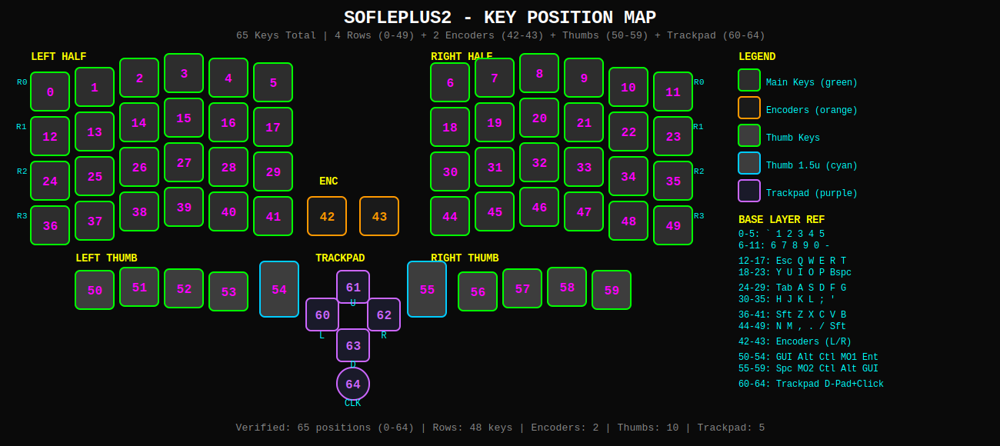
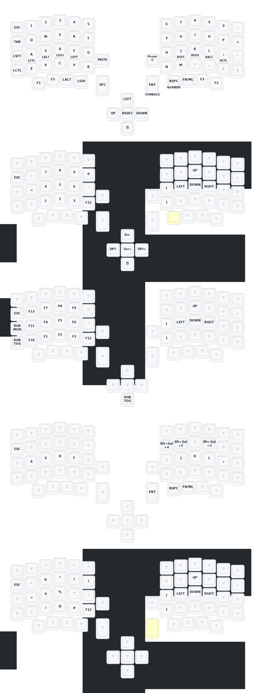

# SoflePLUS2 Custom Firmware

[](https://github.com/david-lai-jpg/sofle-plus-2-config/actions/workflows/build-firmware.yml)
[](https://github.com/david-lai-jpg/sofle-plus-2-config/actions/workflows/draw-keymap.yml)

> Split ergonomic keyboard with Azoteq trackpad | Vial-QMK | RP2040

---

## Architecture

| Component | Detail |
|-----------|--------|
| MCU | RP2040 (rp2040 bootloader) |
| Framework | Vial-QMK (runtime remapping without reflash) |
| Split | Master left, USB UART serial |
| Trackpad | Azoteq TPS65 (65mm) or TPS43 (43mm), right half |
| Display | SSD1306 OLED (I2C, left half) |
| RGB | 72 WS2812 LEDs (36 per half, matrix) |
| Encoders | 1 per half (resolution 2) |
| Layers | 6 default (10 available via Vial) |
| Polling | 1ms USB (gaming-grade) |
| EEPROM | 32KB logical / 128KB physical (wear-leveling) |

## Key Position Map

Refer to [`KEY_POSITIONS.svg`](KEY_POSITIONS.svg) for physical key numbering (0-64).



65 keys total: 4 rows × 6 columns per half (48) + 2 encoders + 5 thumb keys per half (10) + 5 trackpad keys.

## Keymap



### Layer 0 — BASE (QWERTY)

Standard QWERTY layout with number row. Home row modifiers on thumb cluster.

| Region | Keys |
|--------|------|
| Row 0 | `` ` `` `1` `2` `3` `4` `5` — `6` `7` `8` `9` `0` `-` |
| Row 1 | `Esc` `Q` `W` `E` `R` `T` — `Y` `U` `I` `O` `P` `Bspc` |
| Row 2 | `Tab` `A` `S` `D` `F` `G` — `H` `J` `K` `L` `;` `'` |
| Row 3 | `Shift` `Z` `X` `C` `V` `B` — `N` `M` `,` `.` `/` `Shift` |
| Thumb L | `GUI` `Alt` `Ctrl` `MO(1)` `Enter` |
| Thumb R | `Space` `MO(2)` `Ctrl` `Alt` `GUI` |
| Encoder L/R | Vol- / Vol+ |
| Trackpad | ← ↑ → ↓ Click |

### Layer 1 — SYMBOLS + NUMPAD

F-keys across the top. Symbols on the left, numpad on the right. Trackpad controls on d-pad keys.

| Region | Keys |
|--------|------|
| Row 0 | `F12` `F1` `F2` `F3` `F4` `F5` — `F6` `F7` `F8` `F9` `F10` `F11` |
| Row 1 | `` ` `` `!` `@` `[` `]` `/` — `-` `7` `8` `9` `,` `Bspc` |
| Row 2 | `~` `#` `$` `(` `)` `&` — `=` `4` `5` `6` `*` `Del` |
| Row 3 | `Caps` `%` `^` `▽` `▽` `*` — `NumLk` `1` `2` `3` `/` `KpEnt` |
| Thumb R | `▽` `▽` `Kp.` `0` `=` |
| Trackpad | `Scr-` `DPI-` `Scr+` `DPI+` Click |

### Layer 2 — NAVIGATION

Arrow keys, page navigation, and screen tools on the right half.

| Region | Keys |
|--------|------|
| Row 1 R | `PgUp` `Home` `↑` `End` `PrtSc` `▽` |
| Row 2 R | `PgDn` `←` `↓` `→` `Ins` `▽` |
| Trackpad | `▽` `▽` `▽` `▽` `RGB` |

### Layers 3–5 — RESERVED (Vial)

All transparent — customize via Vial GUI.

## Custom Keycodes

### Trackpad Controls

| Keycode | Function |
|---------|----------|
| `CURSOR_SPEED_UP/DN` | Adjust cursor DPI (1-6) |
| `CURSOR_SPEED_RESET` | Reset to default (3) |
| `SCROLL_SPEED_UP/DOWN` | Adjust scroll speed (1-8) |
| `SCROLL_DIR_V/H` | Toggle scroll directions |
| `TRACKPAD_TOGGLE` | Enable/disable trackpad |
| `TRACKPAD_LAYER_SCROLL_SET` | Set current layer to scroll mode |
| `TRACKPAD_LAYER_SWIPE2_SET` | Set current layer to 2-finger swipe |
| `TRACKPAD_LAYER_SWIPE3_SET` | Set current layer to 3-finger swipe |
| `TRACKPAD_LAYER_RESET` | Reset layer to default cursor |

### Sniper Mode

| Keycode | Function |
|---------|----------|
| `SNIPER_MO` | Momentary precision mode |
| `SNIPER_TOG` | Toggle precision mode |
| `SNIPER_SET_MODS` | Learn sniper modifiers |
| `SNIPER_DPI_UP/DOWN` | Adjust sniper sensitivity |

### Misc

| Keycode | Function |
|---------|----------|
| `CK_ATABF/R` | Super Alt-Tab forward/reverse |
| `CK_PO` | Power options |
| `OS_DETECTION_TOGGLE` | Toggle OS detection (default OFF, Linux-safe) |
| `ZMTOG` | Toggle zoom gestures |

## Y-Axis Compensation (TPS65 Only)

The TPS65 at 270° rotation causes slow vertical cursor movement. A compensation factor scales Y-axis movement:

```c
#define Y_AXIS_COMPENSATION 1.0f  // Adjust to match X-axis speed
```

| Y-axis too slow | Y-axis too fast |
|-----------------|-----------------|
| Increase: `1.3f`, `1.5f`, `2.0f` | Decrease: `0.8f`, `0.7f` |

## RGB Layer Indicators

| Layer | Color | Condition |
|-------|-------|-----------|
| 0 | Default RGB effect | — |
| 1 | Green | Active |
| 2 | Gold | Active |
| 3 | Cyan | Active |
| — | Red | Caps Lock ON |

All indicators scale with user-set RGB brightness.

## Build

### GitHub Actions (Automatic)

Push to `main`/`master` → firmware builds → download `.uf2` from Actions artifacts.

Two parallel jobs:
- **TPS65** — always builds
- **TPS43** — builds on tps43-403d changes or manual trigger

Keymap SVGs auto-regenerate on any `keymap.c` change via the Draw Keymap workflow.

### Local Build

```bash
# Prerequisites (macOS)
brew install qmk/qmk/qmk

# Clone Vial-QMK
git clone --recurse-submodules https://github.com/vial-kb/vial-qmk
cd vial-qmk

# Copy source
cp -r /path/to/sofle-plus-2-config keyboards/sofleplus2

# Compile
qmk compile -kb sofleplus2 -km tps65-403d   # or tps43-403d
# Output: .build/sofleplus2_tps65-403d.uf2
```

### Generate Keymap SVGs Locally

```bash
python3 scripts/draw-keymap.py              # all variants
python3 scripts/draw-keymap.py tps65-403d   # specific variant
```

Output goes to `keymap-drawer/`.

## Flashing

1. **Save your Vial keymap** before flashing
2. Download `.uf2` from GitHub Actions artifacts
3. Connect USB to **LEFT** half
4. **Double-press** reset button quickly
5. Drag `.uf2` to the **RPI-RP2** drive
6. Wait for completion
7. Repeat for **RIGHT** half (same `.uf2`)
8. Reconnect and test

## Repository Structure

```
├── KEY_POSITIONS.svg          # Physical key position reference (65 keys)
├── CLAUDE.md                  # AI assistant project instructions
├── keyboard.json              # QMK keyboard definition
├── config.h                   # Main config (matrix, features, split)
├── rules.mk                   # Build rules (MCU, drivers)
├── sofleplus2.c/h             # Keyboard implementation
├── encoder.c                  # Encoder callbacks
├── oled.c                     # OLED display
├── keymaps/
│   ├── tps65-403d/            # TPS65 (65mm trackpad)
│   │   ├── keymap.c           # Keymap + custom logic
│   │   ├── config.h           # TPS65-specific config
│   │   ├── rules.mk           # Variant build rules
│   │   └── vial.json          # Vial layout definition
│   └── tps43-403d/            # TPS43 (43mm trackpad)
├── scripts/
│   └── draw-keymap.py         # Keymap SVG generator
├── keymap-drawer/             # Generated keymap SVGs
└── .github/workflows/
    ├── build-firmware.yml     # Firmware build pipeline
    └── draw-keymap.yml        # Keymap SVG auto-generation
```

## Keymap Variants

| Variant | Trackpad | Rotation | Y-Axis Fix | Scroll Distance |
|---------|----------|----------|------------|-----------------|
| `tps65-403d` | TPS65 65mm | 270° | Yes (1.0f) | 10 |
| `tps43-403d` | TPS43 43mm | 180° | No | 8 |
